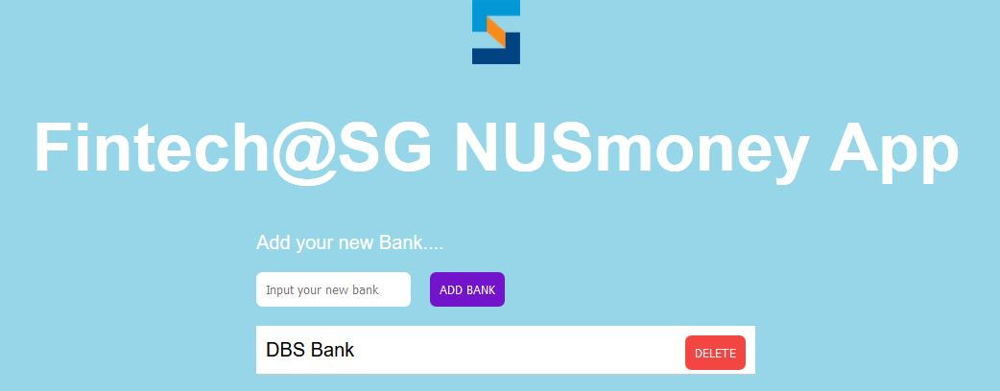

# NUSMoney Frontend

1. Create react project
    ```
    npx create-react-app nusmoney
    ```
2. Replace `App.js, App.css,brand-logo.png` reference code
* App.js
    ```javascript
    import React from "react";
    import logo from "./brand-logo.png"
    import "./App.css";

    class App extends React.Component {
    constructor(props) {
        super(props);
        this.state = {
        newBank: "",
        bankList: []
        };
    }

    addBank(bankName) {
        if (bankName !== "") {
        const newBank = {
            id: Date.now(),
            value: bankName,
            isDone: false
        };
        const bankList = [...this.state.bankList];  //get the Banklist from state
        bankList.push(newBank); //add new back to the list

        this.setState({   //update the state
            bankList,
            newBank: ""
        });
        }
    }

    deleteItem(id) {
        const bankList = [...this.state.bankList];
        //const updatedbankList = bankList.filter(item => item.id !== id);
        const updatedbankList = bankList.filter(function(item){return item.id !== id});
        this.setState({ bankList: updatedbankList });
    }

    updateInput(input) {
        this.setState({ newBank: input });
    }

    render() {
        return (
        <div>
            
            <h1 className="app-title">Fintech@SG NUSmoney App</h1>
            <div className="container">
            Add your new Bank....
            <br />
            <input
                type="text"
                className="input-text"
                placeholder="Input your new bank"
                required
                value={this.state.newBank}
                onChange={e => this.updateInput(e.target.value)}
            />
            <button
                className="add-btn"
                onClick={() => this.addBank(this.state.newBank)}
                disabled={!this.state.newBank.length}
            >
                Add Bank
            </button>
            <div className="list">
                <ul>
                {this.state.bankList.map( (item) => {
                    return (
                    <li key={item.id}>
            
                        {item.value}
                        <button
                        className="btn"
                        onClick={() => this.deleteItem(item.id)}
                        >
                        Delete
                        </button>
                    </li>
                    )
                    }
                )}
                <li>
                    DBS Bank
                    <button className="btn">Delete</button>
                </li>
                </ul>
            </div>
            </div>
        </div>
        );
    }
    }

    export default App;
    ```

* App.css
    ```css
    body {
    background: #97d5e8;
    font-family: "Montserrat", sans-serif;
    font-size: 20px;
    }

    .logo {
    display: block;
    margin-left: auto;
    margin-right: auto;
    }

    .input-text {
    display: inline;
    margin: 0;
    border: none;
    border-radius: 0.4rem;
    padding: 10px;
    }

    .list ul li button {
    position: absolute;
    right: 0%;
    background: #f34541;
    color: #fff !important;
    text-transform: uppercase;
    text-decoration: none;
    margin-left: 10px;
    margin-right: 10px;
    padding: 10px;
    border-radius: 0.4rem;
    display: inline-block;
    border: none;
    }

    .add-btn {
    color: #fff !important;
    text-transform: uppercase;
    text-decoration: none;
    background: #7313cb;
    margin: 20px;
    padding: 10px;
    border-radius: 0.4rem;
    display: inline-block;
    border: none;
    }

    .app-title {
    text-align: center;
    color: #fff;
    font-size: 70px;
    }
    ul {
    /* remove default padding and margin from ul*/
    margin: 0px;
    padding: 0px;
    }
    .list ul li {
    display: block;
    width: 100%;
    text-decoration: none;
    color: #000000;
    background-color: #ffffff;
    line-height: 30px;
    border-bottom-style: solid;
    border-bottom-width: 1px;
    border-bottom-color: #cccccc;
    padding: 10px;
    position: relative;
    }

    .container {
    color: #fff;
    max-width: 500px;
    margin: auto;
    }
    ```

3. Navigate to nusmoney. Start the server
    ```
    npm start
    ```
4. Navigate browser to [http://localhost:3000](http://localhost:3000)
5. The page should display


